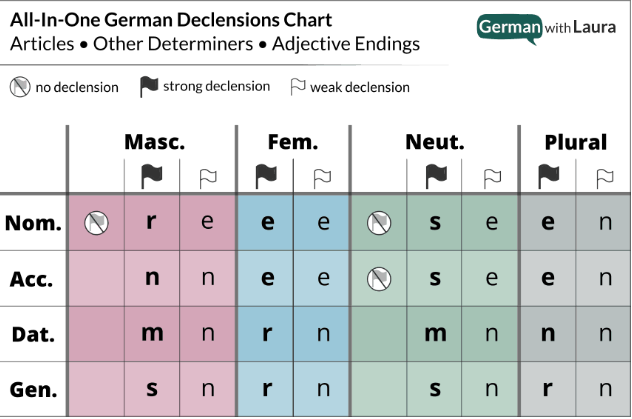
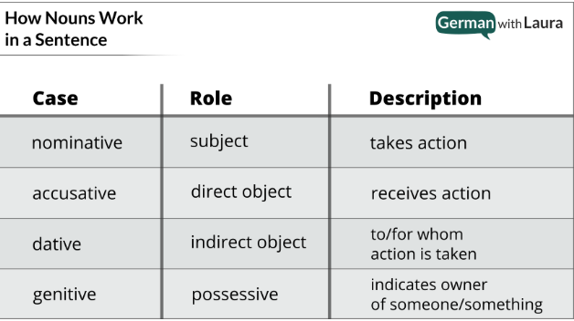

## Alphabet

ABCDEFGHIJKLMNOPQRSTUVWXYZÄÖÜẞ  
abcdefghijklmnopqrstuvwxyzäöüß

## Articles

* Der - Masculine
* Die - Feminine
* Das - Neuter

## Word Position Order
TBD

## Declensions

[German Declensions With Laura](https://germanwithlaura.com/declension/)

German uses declensions to provide crucial information about the nouns in a sentence — so that we can know who is doing what to whom.

**English is a analytic language:** we know who is doing what to whom in a sentence based on word order.

**German is an inflected language:** we know who is doing what to whom in a sentence because of the declensions that ‘flag’ the role (e.g. subject, direct object) of each noun.

The case of the noun is how we know what role in the sentence it’s playing. And the gender of the noun is an inseparable feature of the noun that has to come along for the ride. Since declensions tell us the gender & case of each noun, declensions change dependent on if a noun is masculine, feminine, neuter, or plural AND dependent on if the case is nominative, accusative, dative, or genitive.

### All In One Declension Chart

**Determiners**: a, the, some, few, this, etc. that tell us how many of the noun or which one.

**Adjectives**: describe some feature of the noun (e.g. big, small, round, flat, blue).

> For example, if I need to plug in the determiner this (dies-), dependent on where in the chart it needs to go, I might get any of these values: dieser, diese, dieses, diesen, diesem.

### Types of Declensions

1. Strong declensions: better (but not flawlessly) indicate the gender/case of the noun because they are the most varied.
2. Weak declensions: do not indicate the gender/case of the noun because they have almost no variation (there are just two options: -e or -en).

### Nouns and their gender

[Noun groups and exceptions](https://germanwithlaura.com/noun-gender/#noun-groups)

You can memorize der, die and das for all nouns, but there is a better way. German noun genders are determined by either group or by form.

#### Noun Group Examples:

**Masculine (der):**

* Alcoholic and plant-based drinks
* Currency
* Days, Months and Seasons
* Directions
* Male persons and animals
* Mountains and mountain ranges
* Non-German Rivers
* Outer Space
* Rocks and Minerals
* Weather - doesn't track well... die Sonne, die Wolke...

**Feminine (die):**

* Female persons and animals
* Airplanes, motorcycles, ships
* Numerals used as nouns
* Rivers within Germany, Austria and Switzerland
* Trees, Fruits and Flowers

**Neuter (das):**

* Alphabet
* Continents, cities, provinces and most countries
* Cafes
* Colors
* Gerunds - a form that is derived from a verb but that functions as a noun (running, asking...)
* Hotels
* Languages
* Metals and chemical elements
* Movie theaters
* Other parts of speech used as nouns (gerunds, colors, languages, English -ing forms)
* Restuarants
* Scientific units & measurements
* Young persons and baby animals

#### Noun Form Examples:

The end of nouns, or, the suffix is what determines the gender of the noun.

There are certain suffixes that are almost exclusively masculine, feminine, and neuter.

Masculine: -ant, -ast, -ich, -ig, -ismus, -ling, -or, -us

Feminine: -a, -anz, -enz, -ei, -ie, -heit, -keit, -ik, -sion, -tion, -sis, -tät, -ung, -ur, schaft

Neuter: -chen, -lein, -icht, -il, -it, -ma, -ment, -tel, -tum, -um

### Noun Cases

